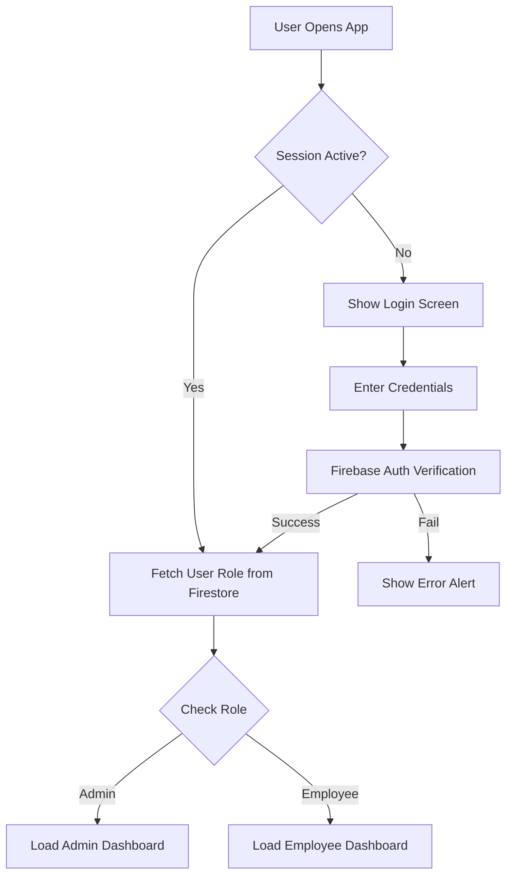

# MCD HRMS - Comprehensive Technical Documentation

## 1. Executive Summary
**MCD HRMS** (Municipal Corporation of Delhi - Human Resource Management System) is a modern, responsive web application designed to digitize and streamline HR operations. It serves two primary user roles: **Administrators/HR** and **Employees**. The system handles attendance, payroll, performance tracking, transfers, grievances, and employee management in a unified interface.

## 2. Technology Stack

### Frontend
- **Framework**: [React 18](https://react.dev/) - Component-based UI architecture.
- **Build Tool**: [Vite](https://vitejs.dev/) - Fast development server and optimized production build.
- **Styling**: 
  - **Bootstrap 5**: Grid system and base components.
  - **Custom CSS**: Glassmorphism effects, mobile optimizations, and Indian Govt color theme (Navy, Saffron, Green).
- **Icons**: SVG Icons (Lucide/Feather style).

### Backend (Serverless)
- **Platform**: [Firebase](https://firebase.google.com/)
- **Authentication**: Firebase Auth (Email/Password) with improved session persistence.
- **Database**: Cloud Firestore (NoSQL) - Real-time data syncing.
- **Hosting**: Firebase Hosting (CDN-backed static hosting).

## 3. System Architecture & Logic

### 3.1 Directory Structure
```
src/
├── assets/         # Static assets and global styles (index.css)
├── pages/          # Route components (Dashboard, Attendance, etc.)
├── App.jsx         # Main Layout, Router, and Auth State Manager
├── backend.js      # API Layer - All interactions with Firebase
├── firebase.js     # Firebase Configuration initialization
└── main.jsx        # Entry point using ReactDOM
```

### 3.2 Key Logic Flows

#### Authentication & Routing (`App.jsx`)
- **State**: Uses `onAuthStateChanged` to track user session.
- **Role-Based Access Control (RBAC)**:
  - Users have a `role` field in Firestore (`admin`, `hr`, `employee`).
  - `App.jsx` conditionally renders tabs and routes based on this role.
  - **Admins**: Full access (Payroll Edit, Employee Mgmt, Settings).
  - **Employees**: Read-only access to their own data, Write access only for daily attendance and grievance submission.

#### Mobile Optimization Logic
- **Adaptive Layout**: 
  - Desktop: Sidebar/Top-bar navigation.
  - Mobile: Hamburger menu with Slide-out drawer + Bottom Navigation Bar for quick access.
- **Safety**: Uses CSS `env(safe-area-inset-bottom)` for notched devices (iPhone users).
- **Touch**: `touch-action: manipulation` to remove 300ms tap delay.

### 3.3 Core Modules

#### A. Dashboard (`Dashboard.jsx`)
- **Logic**: 
  - **Admin View**: Aggregates total employee counts and departmental stats using `getDocs` on `users` collection.
  - **Employee View**: Fetches personal attendance stats (Present/Absent counts) and salary overview.
- **UI**: Uses "Control Center" style cards. Includes a CSS-based blur modal for Profile viewing.

#### B. Attendance System (`Attendance.jsx`)
- **Database Schema**: Collection `attendance`. Document ID format: `${date}_${empId}` to ensure one record per user per day.
- **Admin Features**: 
  - View all staff for a selected date.
  - Mark P/A/L (Present/Absent/Leave).
  - **Reset Logic**: New feature allowing deletion of a record if marked wrongly.
- **Employee Features**: 
  - View personal history sorted by date.
  - Calculated monthly stats.

#### C. Payroll Management (`Payroll.jsx`)
- **Schema**: Stored within `users` collection or separate `payroll` collection mapped by `empId`.
- **Logic**: 
  - Admins update Basic, DA, HRA.
  - System automatically calculates Totals and Annual Package.
  - Updates are real-time reflected in the employee's dashboard.

#### D. Performance Tracking (`Performance.jsx`)
- **Logic**: 
  - Star rating (1-5) and comments.
  - **Edit Logic**: Admin can re-open a rating modal to update existing scores.
  - Data persisted in Firestore under specific user documents or sub-collections.

## 4. Problem Solving & Solutions

### Problem 1: Modal Background Blur Glitch
- **Issue**: The Profile modal's backdrop blur was not covering the entire screen because it was nested inside a container with `overflow: hidden` or lower z-index context.
- **Solution**: Moved the Modal component in JSX to be a direct child of the main container or used [React Portals] concept (visually moved outside loops). applied `position: fixed; z-index: 9999;` to ensure it sits on top of everything.

### Problem 2: UI Inconsistency on Attendance Cards
- **Issue**: The "Present" card had a hover animation that "Absent" and "Leave" cards lacked, confusing users.
- **Solution**: Standardized the CSS classes. Removed `group-hover-effect` from specific cards to maintain a flat, professional "Dashboard" look for data summaries, keeping hover effects only for interactive elements.

### Problem 3: Mobile Usability
- **Issue**: Desktop navigation (Pill tabs) was unusable on phones.
- **Solution**: Implemented a "Native App Shell" pattern:
  - **Hamburger Menu**: For accessing secondary features (Settings, Logout).
  - **Bottom Nav**: For primary features (Dashboard, Attendance).
  - **CSS Enhancements**: Increased tap targets to min 44px-48px for touch accuracy.

### Problem 4: Empty Employee Cards
- **Issue**: Data sync issues caused "undefined" to appear on Dashboard cards.
- **Solution**: Added Optional Chaining (`user?.email`) and fallback UI states (Spinners/Loading text) while Firebase fetches data.

## 5. System Workflows

### Authentication Flow


### Attendance Marking Flow (Admin)
```mermaid
graph LR
    A[Admin Selects Date] --> B[Fetch Employee List]
    B --> C[Fetch Existing Attendance for Date]
    C --> D[Render List with Status Buttons]
    D --> E{Action?}
    E -- Mark Present --> F[Write 'present' to Firestore]
    E -- Mark Absent --> G[Write 'absent' to Firestore]
    E -- Reset --> H[Delete Document from Firestore]
    F --> I[Update UI Locally (Optimistic)]
    G --> I
    H --> I
```

## 6. Future Roadmap
1. **Biometric Integration**: Linking attendance with physical hardware.
2. **Push Notifications**: Firebase Cloud Messaging for leave approvals.
3. **Report Generation**: PDF export for monthly payroll slips.
4. **PWA Support**: Making it installable as a native app (Service Workers).

## 7. How to Run
For detailed setup, refer to `README.md`.
1. `npm install`
2. `npm run dev`
3. Build: `npm run build`
